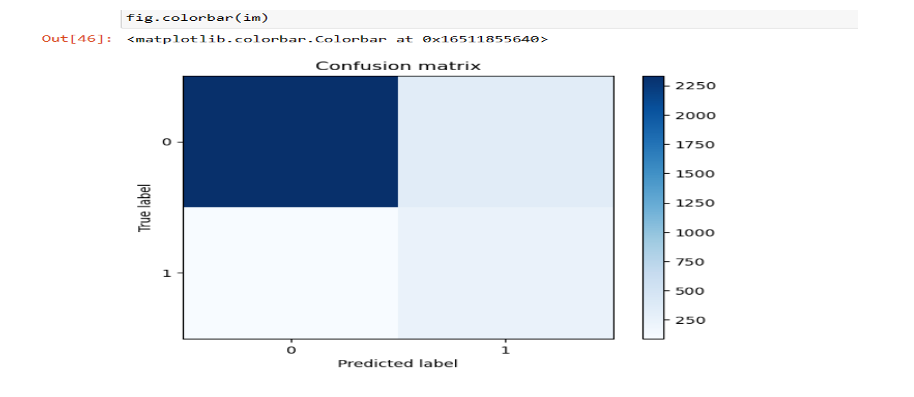
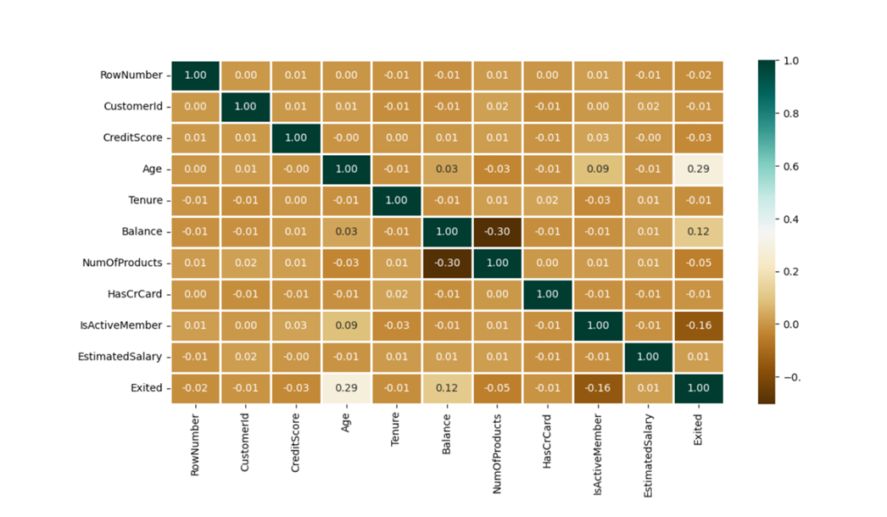

# 🏦 Bank Customer Churn Prediction

## 📌 Overview
This project predicts **customer churn in the banking sector** using supervised machine learning models.  
By identifying customers at risk of leaving, banks can take proactive steps to **improve retention strategies** and reduce financial losses.

Dataset: [Churn_Modelling.csv](./Churn_Modelling.csv) (10,000 rows × 14 features).  

---

## 🔧 Tools & Libraries
- Python (Pandas, NumPy, Scikit-learn, Matplotlib, Seaborn)  
- Jupyter Notebook  
- Models: **Linear Regression, Decision Tree, Random Forest**  

---

## 📊 Methods
1. **Data Preprocessing**
   - Handled missing values, outliers, duplicates  
   - Applied **one-hot encoding** for categorical variables  
   - Removed irrelevant features (IDs, row numbers)

2. **Exploratory Data Analysis (EDA)**
   - Distribution plots of demographics, tenure, products  
   - Correlation heatmaps to assess feature importance  

3. **Modeling**
   - Built and trained three models: Linear Regression, Decision Tree, Random Forest  
   - Split dataset into 70% training and 30% testing  

4. **Evaluation**
   - Accuracy, R² Score, Mean Squared Error (MSE)  
   - Confusion Matrix for classification performance  

---

## ✅ Results
- **Decision Tree** → ~80% accuracy  
- **Random Forest** → ~85% accuracy (best performer)  
- **Linear Regression** → Lower predictive power for classification  

**Key Insight:**  
Random Forest is most effective for capturing complex relationships in customer churn data.  

---

## 📸 Sample Visualizations
  
*Confusion matrix of Random Forest classification*  

  
*Correlation of key variables with churn*  

---

## 🔗 Files in this Folder
- `churn_model.ipynb` → Jupyter Notebook with full analysis  
- `Churn_Modelling.csv` → Dataset  
- `confusion_matrix.png`, `churn_heatmap.png` → Visuals  
- `README.md` → Project summary  

---

## 📖 Insights
- **Age, Balance, and Products owned** were strong churn predictors  
- **Active membership** and **credit card ownership** reduced churn likelihood  
- Predictive modeling enables banks to focus on **at-risk customers** with targeted retention  

---

## 🚀 Future Work
- Try advanced models (XGBoost, LightGBM, Neural Networks)  
- Use real-time streaming data for churn prediction  
- Build a dashboard in Power BI/Tableau for executive decision support  
